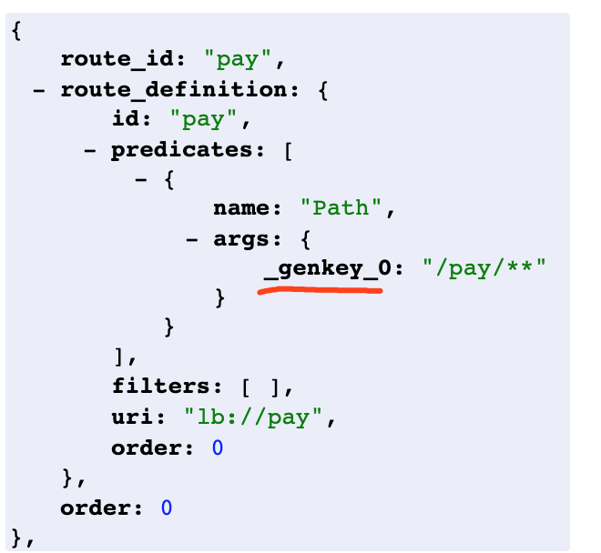

# VM options
```
-Dcsp.sentinel.app.type=1
-Dnacos.addr=localhost:8848
-Dnacos.namespace=dev
-Dcsp.sentinel.dashboard.server=127.0.0.1:8080
```

#### 动态网关
##### 参数封装
> 前端传参
```
1.当 predicates ，filters 中的 args 参数无key时，默认生成 _genkey_0
2.当 predicates ，filters 中的 args 参数由多个KV值时,key.数字区别
```
